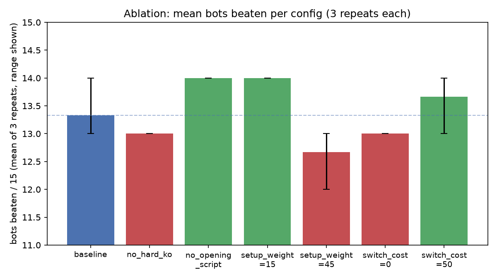

# COMPSYS 726 Report 草稿

> 写作草稿，目前是中文版本，方便先把内容和逻辑理顺，最终提交需要英文（单栏、11 号字、
> 不超过 6 页，不含参考文献）——写完中文定稿后再翻译成英文，不用现在就纠结英文措辞。
> 结构对应 [Report_Outline.md](Report_Outline.md) 里的大纲。这是草稿空间，不是最终排版稿。

## 1. Introduction

Frankly,我在开始这个项目之前，没有实际玩过或看过 Pokémon 竞技对战，了解程度近乎为0。不过我曾经玩过炉石传说那种策略型卡牌游戏，那种"我对对手的选项了解多少"和"在这种不确定性下该怎么分配资源"之间，跟 Pokémon 对战每一回合要做的事情类似。之所以一开始就说明这一点，不是自谦或免责声明，而是因为**这直接决定了我们的方法论**：因为没有现成的领域直觉可以依赖，整个设计过程必须从系统性的、有据可查的调研开始，而不是凭经验瞎猜。同时，这也真正贴合并采用专家系统架构 ([1] https://en.wikipedia.org/wiki/Expert_system), 即推理机能够利用知识库中的启发式规则进行逻辑推演，且具备明确的解释设施。这种架构设计确保了智能体在每一回合中的决策路径均是可追溯且可验证的。因为是新手，所以我们先从宝可梦对战的基础尝试发起一轮Investigation，梳理出一套战斗决策系统需要考虑的关键因素。一共识别出六个核心 factors：
1. **属性克制关系（type effectiveness）**——宝可梦各属性之间两两的伤害倍率关系，几乎是所有选招式、判断换人是否安全的决策的底层依据。
2. **技能的附加效果（move secondary effects）**——招式不只是威力数字，还带有异常状态触发几率、能力变化、场地效果（钉子/天气）、反作用力、命中率这些信息，这些共同决定了一个招式"实际是用来干什么的"。
3. **持有道具（held items）**——比如 Choice 系列锁招道具（用灵活性换威力）、不可被移除的永久变身道具、一次性防御类道具，这些道具各自带来一套额外的规则，战斗决策系统必须考虑进去。
4. **太晶化（Terastallization）**——Gen9 特有、一局限用一次、不可逆的属性切换机制，是这一代游戏里战斗中期博弈复杂度最大的来源。
5. **分级强度体系（Ubers/OU/UU/RU/NU）**——决定了对手队伍里允许出场的宝可梦强度上限，也是这次任务"五档对手强度梯队"这个结构的来源。
6. **随机的 teampreview 出场顺序**——通过查看 `poke_env` 库的源码我验证得出三种对手 AI风格选择开场首发精灵时都是**均匀随机**的，而不是固定或可预测的顺序。这个发现直接排除了任何"预判对面固定用谁开场"的设计思路，把整个方法论方向推向了"运行时通用判断的规则"，而不是"针对具体对手写死的脚本"。

这六个 factors,就是我们设计的策略的底层支柱。

## 2. Design

*（待写——参考 Report_Outline.md 第 2 节的大纲）*

## 3. Evaluation

### 3.1 Evaluation Methodology：单次评分 vs. 我们自己的调参可信度

作业本身对"赢没赢一个 bot"的判定规则很直接：每个 bot 打 3 局（best-of-three），胜率 >0.5（也就是
3 局赢 ≥2 局）就算赢下这个 bot；最终名次按打赢的 bot 数量排，映射到分数表（`expert_main.py` 的
`assign_marks`）。关键的一点是：**这个评测大概率只会被官方跑一次**——教学团队拿到提交的智能体后，
用固定的 15-bot 梯队评一遍，那一次运行的结果（不管过程中招式命中/伤害浮动/AI 自身随机性带来多少
变数）就是最终成绩，不会反复跑几轮取平均。

这里有一个方法论上的区分，我们在开发过程中主动做出来了，值得写清楚。我们发现：**同一份智能体代码，
对着同一个固定梯队重跑，结果会不一样**（比如两次完全相同的代码，一次打赢 13/15，一次打赢 14/15）；
甚至两个只差一个可调参数的配置，总分打平，但输给的却是不同的 bot。这说明单次评测结果不足以用来
可靠地比较两个候选设计或参数取值——单次"赢了"的那个配置，很可能只是运气好。为了让我们自己的
迭代调参决策站得住脚，我们把本地的消融实验工具（`analysis/run_ablation.py`）扩展成支持对每组候选
配置重复跑完整的 15-bot 梯队若干次，报告"打赢 bot 数"的均值和标准差，而不是只信一次的结果。
只有当两个配置之间的差异明显大于多次重跑观察到的噪声范围（标准差）时，才把这个差异当成真实存在、
值得保留的效果。

这里必须诚实说明一点：**这套"多次重跑"的方法论只用在我们自己内部的调参决策上，不会改变作业本身
的评分方式**。真正被打分的那一次提交，依然只跑一遍固定梯队，所以不管调参过程做得多严谨，最终成绩
里始终会带有那一次运行本身的运气成分。多次重跑调参买到的不是"评分那天一定表现好"这个保证，而是
**提高"我们提交的这套参数平均表现确实更强"的把握，从而提高评分那天抽到好结果的概率**。这个"可靠地
评估一个设计选择"和"任何单次评测本身固有的方差"之间的区别，本身就值得在报告里讲清楚——它也直接
促成了一部分设计目标（见 2.6）：与其只是"绕着方差调参数"，不如直接想办法**降低方差本身**（比如
减少对局被拖进 90 秒超时墙的概率），后者对"评分那天也稳定表现好"更有直接帮助。

### 3.2 实验一：队伍强度 vs. 决策逻辑的贡献隔离（控制变量）

评分标准明确要求"不能只看排名好不好，要证明方法本身是按设计在起作用"。为此我们在早期做了一次
控制变量实验：先把队伍换成一支网上找的高强度 Ubers 队伍（后续一直沿用，没再换过），但 `_choose_move`
先不动、继续用框架自带的纯随机选招（`choose_random_move`）。这样"队伍强度"和"决策逻辑"这两个
变量就被分开了——只看光靠数值压制、招式随便选，纯随机能拿下几场。

结果：`#15 名，mark=1.0，1/15 bots beaten`——15 个 bot 里只赢了 `random-ru` 这一个（胜率
0.67，其余全部 <0.5）。也就是说，**同一支强度队伍，光靠随机选招基本等于送人头**；后面把决策逻辑
换成我们的规则系统后（队伍完全没变），胜场从 1/15 跳到 13+/15（见下一节消融表格里的 `baseline`
行）。这个跳变直接证明了：胜率的提升主要来自我们设计的决策逻辑，而不是"队伍本来就选得好、随便
打打也能赢"——这正是评分标准要求的"证明方法本身按设计运作"的量化证据。

### 3.3 实验二/三：消融实验——从单次筛选到多次重跑确认，量化每条规则/权重的贡献

上一节隔离的是"要不要有决策逻辑"这个粗粒度问题；这一节往下细化一层——**决策逻辑内部具体哪几条
规则、哪个权重，真的在按设计起作用**，同样是靠数据说话、不是凭直觉调参数。这也是 3.1 节讲的
方法论区分在实践中的具体应用：先用一次筛选低成本找方向，再用多次重跑把噪声和真实效果分开。

我们分两轮做：第一轮（2026-07-21）是单次筛选——9 组配置各跑一次完整 15-bot 梯队，目的只是低成本
找出哪些参数值得深挖，不直接下结论。第二轮（2026-07-22）是多次重跑确认——对第一轮标出"敏感"或
"信号不明确"的 7 组配置各重跑 3 次，取均值和标准差，把噪声和真实效果分开。完整数据见
`analysis/results/`，逐条解读见 [Ablation_Study_v1.md](Ablation_Study_v1.md)。

| 配置 | 改动 | mean 胜场 / 15 | stdev | 胜场区间 |
|---|---|---|---|---|
| `baseline` | 不改，v1 默认值 | 13.33 | 0.29 | 13–14 |
| `no_hard_ko` | 关闭硬短路 KO 规则 | 13.00 | 0.00 | 13–13 |
| **`no_opening_script`** | 关闭 Ribombee 固定开局脚本 | **14.00** | **0.00** | 14–14 |
| **`setup_weight_15`** | 铺垫打分权重 30→15 | **14.00** | **0.00** | 14–14 |
| `setup_weight_45` | 铺垫打分权重 30→45 | 12.67 | 0.29 | 12–13 |
| `switch_cost_0` | 换人成本 25→0 | 13.00 | 0.00 | 13–13 |
| `switch_cost_50` | 换人成本 25→50 | 13.67 | 0.29 | 13–14 |

三个观察，直接对应"数据驱动调整带来更好结果"这条主线：

1. **筛选轮里看起来"打平、说不清"的信号，多次重跑后变成了明确的正向发现**：`no_opening_script`
   第一轮跟 `baseline` 战绩打平（都是单次 14/15），第一轮报告里只能写"可能是噪声"；重跑 3 次后
   它稳定在 14/15（标准差 0），比 baseline 的均值 13.33 高出一整场且波动更小——这不是运气，是
   一个可以拿来当 v2 默认值候选的真实改进。**这正是 3.1 节讲的方法论区分在实践中的具体例子**：
   没有多次重跑，我们会一直卡在"说不清"，永远不敢把这个改动当真。
2. **同一个筛选轮判定"敏感"的参数，重跑后能看出它是个双向的甜区，而不是单调关系**：
   `SETUP_BOOST_WEIGHT` 往下调（15）跟 `no_opening_script` 一样稳定拿到 14/15；往上调（45）
   则被坐实为全场最差（12.67/15，还额外在原本稳赢的 `max_damage-uu` 上引入了新的不稳定）。
   默认值 30 不是拍脑袋定的，但也不是最优——下调是这组消融里目前证据最强的一个具体改进方向。
3. **反过来，重跑也能替我们排除一个"看起来有效、其实是噪声"的假象**：筛选轮里 9 组配置有 8 组
   输给 `max_damage-uber`，只有 `baseline` 那次赢了，容易被误读成"baseline 有什么特殊优势"；
   重跑后看到 baseline 那次唯一的胜场标准差高达 0.58（全表最不稳定），而其余 6 组配置全部稳定
   输（标准差 0）——说明这场对局的输赢目前主要由是否卡进 90 秒超时决定，不由这些参数决定。
   **知道"这里调了也没用"跟"这里调了有用"同样重要**：它把后续精力从这几个权重挪到了 v2 的
   "更快结束拉锯战"这个结构性设计目标上（见 2.6），避免在一个已经被证明是死胡同的方向上继续
   浪费调参预算。

### 3.4 噪声从哪来：三层原因，不能简单归因为"样本小"或"90 秒超时"

前面几节反复用到"噪声"/"标准差"这些词，这里专门拆开讲清楚噪声到底从哪来——因为"数据集太小"
和"90 秒超时"看起来像是两个原因，但仔细想其实它们的角色不一样，一个是根本原因，一个只是让根本
原因暴露/放大出来的机制。我们把它拆成三层：

**第一层，真正的随机性根源——战斗机制本身**。这是不管样本量多大都不会消失的东西：招式命中率
判定（不是所有招式 100% 命中）、暴击判定、异常状态附加几率（麻痹全麻、混乱自伤、畏缩）、以及
最关键的一条——**三种对手 AI 风格选首发精灵都是均匀随机的**（这个在 Introduction 里已经提过，
是查 `poke_env` 源码级验证过的，不是猜的）。每一局对面开场派谁上来都不一样，直接改变那一局的
属性克制/速度关系/开局节奏，是目前观察到的胜率波动里权重最大的一个来源。就算把样本量拉到无限大，
这层随机性本身也不会消失——它只会被"平均掉"，而不是被"消除"。

**第二层，样本量太小——不是随机性的来源，而是"没能力把第一层平均掉"**。官方判定规则是 Bo3
（3 局取胜率），我们自己筛选轮也只跑 1 次完整 15-bot 梯队。样本越小，单次幸运/不幸的一局对
"这个 bot 算赢还是算输"这个二元判定的权重就越大——这也是 3.1 节讲的"为什么要做多次重跑"的
直接动机：重跑本身不会让第一层的随机性变小，只是让我们能看清楚它的分布，不被单次结果骗过去。

**第三层，90 秒超时——一个阈值效应，把连续的随机性折叠成二元胜负标签，只在少数"天生拖得久"的
对局上会被放大到能看见的程度**。`MATCH_TIMEOUT_SECONDS=90` 是评测框架的硬约束（不是我们能改的
参数），大多数对局在 15-30 回合内结束，离这道墙还很远，第三层基本不起作用。但少数对局（目前抓到
的典型案例是 `max_damage-uber`，对面带 `Arceus-Fairy` 冥想 + 生命种子，很难被磨穿，经常打到
39-42 回合）天然贴着这道墙——这时候哪怕只是第一层的随机性让某一局多打/少打几个回合，就可能直接
决定这一局是在超时前正常分出胜负，还是被判负。这解释了 3.3 节数据表里一个具体现象：全表标准差
最高的一格（`baseline` 打 `max_damage-uber`，stdev=0.58）恰好就是这个对局，而不是随便某个对手——
不是巧合，是因为只有这个对局同时踩中了"第一层随机性存在"和"第三层阈值就在附近"这两个条件。

**串起来看**：根本随机性（对手随机首发 + 招式概率判定，第一层）→ 在少数拖得久的对局里被 90 秒
超时放大成非黑即白的胜负标签（第三层）→ 样本量太小时（第二层）这个二元结果就直接决定了我们对
"这个配置到底好不好"的判断是否可信。三层缺一不可：如果没有第一层，样本量再小也没关系（结果永远
一样）；如果没有第三层，第一层的随机性顶多让胜率数字有点小幅波动，不会直接翻转胜负；如果没有
第二层（比如能无限次重跑取真实期望值），第一层和第三层造成的波动就都能被看清楚、不会误导决策——
这也是为什么"多次重跑"是我们能想到的、成本最低的应对手段：改不了第一层（战斗机制），改不了
第三层（评测规则），只能在第二层上想办法。

## 4. Reflections

*（待写——参考 Report_Outline.md 第 4 节的大纲）*

## References

*（边写边收集——参考来源清单见 Report_Outline.md）*
