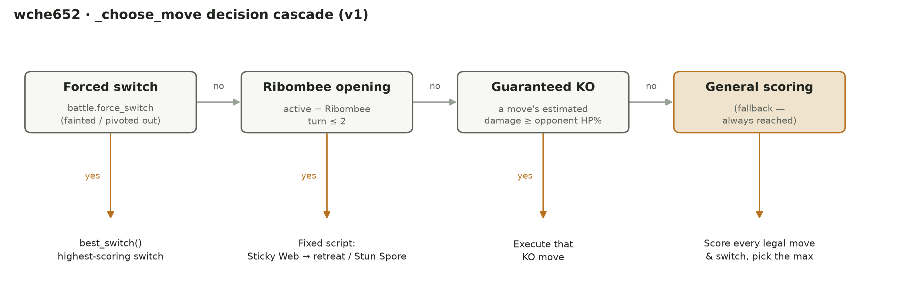

# COMPSYS 726 Report 草稿

> 写作草稿，目前是中文版本，方便先把内容和逻辑理顺，最终提交需要英文（单栏、11 号字、
> 不超过 6 页，不含参考文献）——写完中文定稿后再翻译成英文，不用现在就纠结英文措辞。
> 结构对应 [Report_Outline.md](Report_Outline.md) 里的大纲。这是草稿空间，不是最终排版稿。

## 1. Introduction

Frankly,我在开始这个项目之前，没有实际玩过或看过 Pokémon 竞技对战，了解程度近乎为0。不过我曾经玩过炉石传说那种策略型卡牌游戏，那种"我对对手的选项了解多少"和"在这种不确定性下该怎么分配资源"之间，跟 Pokémon 对战每一回合要做的事情类似。之所以一开始就说明这一点，不是自谦或免责声明，而是因为**这直接决定了我们的方法论**：因为没有现成的领域直觉可以依赖，整个设计过程必须从系统性的、有据可查的调研开始，而不是凭经验瞎猜。同时，这也真正贴合并采用专家系统架构 ([1] https://en.wikipedia.org/wiki/Expert_system), 即推理机能够利用知识库中的启发式规则进行逻辑推演，且具备明确的解释设施。这种架构设计确保了智能体在每一回合中的决策路径均是可追溯且可验证的。因为是新手，所以我们先从宝可梦对战的基础尝试发起一轮Investigation，梳理出一套战斗决策系统需要考虑的关键因素。一共识别出六个核心 factors：
1. **属性克制关系（type effectiveness）**——宝可梦各属性之间两两的伤害倍率关系，几乎是所有选招式、判断换人是否安全的决策的底层依据。
2. **技能的附加效果（move secondary effects）**——招式不只是威力数字，还带有异常状态触发几率、能力变化、场地效果（钉子/天气）、反作用力、命中率这些信息，这些共同决定了一个招式"实际是用来干什么的"。
3. **持有道具（held items）**——比如 Choice 系列锁招道具（用灵活性换威力）、不可被移除的永久变身道具、一次性防御类道具，这些道具各自带来一套额外的规则，战斗决策系统必须考虑进去。
4. **太晶化（Terastallization）**——Gen9 特有、一局限用一次、不可逆的属性切换机制，是这一代游戏里战斗中期博弈复杂度最大的来源。
5. **分级强度体系（Ubers/OU/UU/RU/NU）**——决定了对手队伍里允许出场的宝可梦强度上限，也是这次任务"五档对手强度梯队"这个结构的来源。
6. **随机的 teampreview 出场顺序**——通过查看 `poke_env` 库的源码我验证得出三种对手 AI风格选择开场首发精灵时都是**均匀随机**的，而不是固定或可预测的顺序。这个发现直接排除了任何"预判对面固定用谁开场"的设计思路，把整个方法论方向推向了"运行时通用判断的规则"，而不是"针对具体对手写死的脚本"。

这六个 factors,就是我们设计的策略的底层支柱。

## 2. Design

*（图：`_choose_move` 的四层决策级联——按优先级从高到低依次是强制换人、Ribombee 固定开局脚本
（回合 ≤ 2）、硬短路斩杀检测、通用单回合打分兜底，前三层任意一层条件满足就直接执行、不再往下走。
这是从 [Ablation_Study.md](Ablation_Study.md) 同源的决策架构参考图裁剪出的精简版——只留
顶层四条分支和一句话触发条件，去掉了嵌套子判断和具体打分公式，专门为塞进 6 页篇幅限制画的；
公式细节和团队构成放回正文文字里讲。生成脚本：`analysis/plot_decision_flow.py`。）*

### 2.1 方法论声明

队伍本身是借助 pokeaimmd.com 的队伍生成工具搭建的，不是我们凭经验手搓的。这里要明确一件事：
**这个项目里专家系统的贡献在决策逻辑，不在队伍选择**——给定任意一支合法的 Ubers 队伍，
`_choose_move` 里的规则/打分框架都应该能正常运作。评估这个智能体设计得好不好，看的应该是
"给定这支队伍，决策逻辑有没有把队伍强度兑现成胜率"，而不是"队伍选得好不好"（3.2 节的控制变量
实验就是专门用来把这两件事分开量化的）。

### 2.2 调研方法

因为完全没有 Pokémon 对战经验，整个设计不能从个人直觉出发，只能从系统性调研开始。具体做法是
把 `bots/teams/` 目录下全部 15 个 bot、30 只精灵的属性、特性、持有道具、招式列表逐一解析出来，
整理成 [Opponent_Roster.md](Opponent_Roster.md)。这不是为了针对某个具体对手写死应对方案
（teampreview 是均匀随机的，见 Introduction），而是找**跨档位都成立的通用规律**，作为写"运行时
通用判断规则"的依据。

### 2.3 调研发现 → 设计决策的对应关系

| 调研发现 | 对设计的影响 |
|---|---|
| 麻痹类招式出现在 3 个不同档位（Cobalion/Rotom-Wash/Slowbro），对速度依赖大的精灵杀伤力大 | `_effective_speed` 里麻痹状态让速度直接减半，是"谁先手"判断的一部分，直接决定铺垫招式安不安全 |
| Choice 系列锁招道具很常见（Darkrai/Metagross/Zapdos-Galar 都是 Scarf/Band） | 我方 Kyogre 自己也是 Choice Band——摸清对面第一次出招类型后就能反过来针对性利用"对方也被锁死"这一点 |
| 撒钉子的对手几乎每档都有 | 队伍没有任何清钉/免疫手段（没人带 Heavy-Duty Boots），这是没有解决、诚实承认的短板，见 2.7 |
| 拍落（Knock Off）频率极高 | 队伍里只有 Kyogre/Koraidon 拿的是可被打掉的道具，其余三只是专属道具（Rusted Sword/Spooky Plate/Power Herb 消耗后不受影响），从队伍构成上天然规避了一部分风险 |

不是每条调研发现都对应一个具体的代码分支——**撒钉子**这条就是明确没做的取舍，不是漏掉了，
这一点在 2.7 展开。

### 2.4 决策架构：为什么是"硬短路 + 单回合打分"，不是别的

最早的构想是一条线性脚本：Ribombee 开局放钉子、看情况麻痹或换 Kyogre、雨天瀑布攀登莽过去。
跟这套构想讨论之后，往两个方向做了收敛：

**为什么不做纯 if-elif 优先级链？** 因为除了开局那几回合，中后期的局面组合太多，写死规则会
在没预料到的局面下产生说不清道理的行为。改成对"当前所有合法动作"统一打分、取分数最高的一个，
这样任何局面都有一个可追溯的数值依据，不依赖有没有提前想到这种局面。

**为什么不做多回合搜索/minimax？** 因为这类方法的价值在于预判并反制一个会思考、会博弈的对手；
但通过查 `poke_env` 源码验证过，评测用的三种 AI 风格都不会针对我方动作调整策略，也不会记忆或
学习——面对不会博弈的固定对手，往后推演多个回合换不来额外收益，只会增加复杂度和不可解释性。
单回合价值打分（只看这一步、不做树搜索）在这个前提下是够用的，也更符合专家系统"每一步决策
可解释"的定位（见 Introduction）。

**硬短路的存在，是为了把"结果确定"的情况从打分系统里摘出来单独处理**：如果这回合有招式能
直接斩杀对面，直接用，不需要跟其它候选动作放在同一个打分公式里比较——这类结论在推理链条里
应该是一句话能讲清楚的（"能斩杀就斩杀"），不必绕到"因为算出来的分数 0.97 比 0.82 高"。

最终收敛成图 2.1 那四层级联：force_switch（规则强制，没有选择）→ Ribombee 固定开局脚本
（已验证够用的固定套路，见 2.5.4）→ 硬短路斩杀（结果确定，直接执行）→ 通用打分（其余所有
说不准的情况，统一换算成同一个"这个选择现在值多少"的问题来比较）。四层按"确定性从高到低"排列，
确定的情况优先处理，不确定的情况才交给打分。

### 2.5 具体机制设计

**2.5.1 硬短路 KO 规则**——遍历当前可用的攻击招式，过滤掉属性免疫的选项，估算命中后的伤害
占比，只要覆盖对面当前血量就判定为"能斩杀"；多个候选之间优先选没有反作用力的，再按威力降序，
取最优的直接出招。存在的意义是让"稳赢的这一步"不必和"说不准的其它选项"挤在同一套打分逻辑里
比较。

**2.5.2 换人评分**——换人要同时考虑两个方向：换上去自己能打多疼（进攻端），和换上去会被对面
打多疼（防御端）。只看其中一个方向容易出系统性偏差：只看进攻会忽视被秒的风险，只看防御会换上
一个打不动对面的精灵。具体公式是 `候选人最强招式的伤害估算 − 候选人挨对面攻击的倍率 × 防御风险权重`，
两个方向的分数直接相减，用同一套函数评估所有换人候选（也用于强制换人分支），不为哪只精灵单独
写死判断。

**2.5.3 铺垫招式打分**——剑舞、冥想这类招式本身这一回合不造成伤害，价值完全在于"以后能不能
兑现"，所以核心问题是这回合会不会因为被对面先手打死/打残而完全落空。判断逻辑是：先比双方速度
决定谁先手，再根据先后手选用不同的容忍阈值判断"这回合扛不扛得住对面的来袭威胁"——我方先手时
铺垫这一步确实会生效，判断标准更宽松；对面先手时铺垫可能完全没兑现就被打断，标准更严格。扛不住
的话铺垫分数直接归零，正常输出或换人的分数自然会更高，铺垫选项被自然淘汰，不需要额外加一条
"不要铺垫"的规则。

**2.5.4 Ribombee 固定开局脚本**——开局第一回合双方都还没暴露任何真实数据（道具、努力值、
太晶属性全部未知），这时候用依赖"当前局面信息"的通用打分框架反而容易因为信息不足做出错误
判断。黏黏网起手（削弱对面后续换人的速度）加上第二回合的麻痹粉/急速折返分支，是已经验证过
在信息未知时足够稳的固定开局，所以直接写成脚本、优先级设在通用打分之上，而不是每局都重新
计算一遍"这一步到底该怎么打分"。

### 2.6 明确不做的决策与理由

- **不做多回合搜索/minimax**：已经在 2.4 说明——对手是不会博弈、不会学习的固定 AI，多回合
  推演的价值在于反制一个会思考的对手，这个前提在这次任务里不成立，投入这类复杂度换不来收益。
- **v1 不实现太晶化**：太晶化需要临场判断"这一下能不能把局面掰回来"，涉及的变量（什么时候用、
  用哪个属性、值不值得现在用掉这个只有一次的资源）太多，第一版先不做判断逻辑。不实现不会破坏
  任何东西——队伍文本里的 Tera Type 字段留着，只要决策逻辑不主动触发这个动作，所有精灵全程
  按自己本来的属性正常战斗，是一个干净、可逆的范围限定，也是天然的后续迭代点。

### 2.7 局限性讨论

现在的打分公式里，权重（比如换人的防御风险权重、铺垫招式的强化价值权重）是启发式给出的初始值，
不是从理论推导出来的，这是纯规则专家系统一个不可避免的性质——多少个属性倍率该换算成多少分，
本身没有唯一正确答案，只能设定初始值、用实际对局数据去检验和校准（对应的量化验证见 Evaluation
3.3）。另外，伤害/威胁估算完全基于类型克制和招式基础数据，不含防御方"坚固度"这个维度，也不对
未知对手的招式威力做区分（统一假设一个默认值）——这些都是用有限信息近似未知量的具体例子，
在 Reflections 4.2 有一个具体案例展开讨论。队伍构筑层面，也有明确没解决的短板：没有任何清钉/
免疫钉子的手段（2.3 已提到），频繁换人会持续掉血，这是队伍构成本身带来的限制，不是决策逻辑
能弥补的。

## 3. Evaluation

### 3.1 Evaluation Methodology：单次评分 vs. 我们自己的调参可信度

作业本身对"赢没赢一个 bot"的判定规则很直接：每个 bot 打 3 局（best-of-three），胜率 >0.5（也就是
3 局赢 ≥2 局）就算赢下这个 bot；最终名次按打赢的 bot 数量排，映射到分数表（`expert_main.py` 的
`assign_marks`）。关键的一点是：**这个评测大概率只会被官方跑一次**——教学团队拿到提交的智能体后，
用固定的 15-bot 梯队评一遍，那一次运行的结果（不管过程中招式命中/伤害浮动/AI 自身随机性带来多少
变数）就是最终成绩，不会反复跑几轮取平均。

这里有一个方法论上的区分，我们在开发过程中主动做出来了，值得写清楚。我们发现：**同一份智能体代码，
对着同一个固定梯队重跑，结果会不一样**（比如两次完全相同的代码，一次打赢 13/15，一次打赢 14/15）；
甚至两个只差一个可调参数的配置，总分打平，但输给的却是不同的 bot。这说明单次评测结果不足以用来
可靠地比较两个候选设计或参数取值——单次"赢了"的那个配置，很可能只是运气好。为了让我们自己的
迭代调参决策站得住脚，我们把本地的消融实验工具（`analysis/run_ablation.py`）扩展成支持对每组候选
配置重复跑完整的 15-bot 梯队若干次，报告"打赢 bot 数"的均值和标准差，而不是只信一次的结果。
只有当两个配置之间的差异明显大于多次重跑观察到的噪声范围（标准差）时，才把这个差异当成真实存在、
值得保留的效果。

这里必须诚实说明一点：**这套"多次重跑"的方法论只用在我们自己内部的调参决策上，不会改变作业本身
的评分方式**。真正被打分的那一次提交，依然只跑一遍固定梯队，所以不管调参过程做得多严谨，最终成绩
里始终会带有那一次运行本身的运气成分。多次重跑调参买到的不是"评分那天一定表现好"这个保证，而是
**提高"我们提交的这套参数平均表现确实更强"的把握，从而提高评分那天抽到好结果的概率**。这个"可靠地
评估一个设计选择"和"任何单次评测本身固有的方差"之间的区别，本身就值得在报告里讲清楚——它也直接
促成了一部分设计目标（见 2.6）：与其只是"绕着方差调参数"，不如直接想办法**降低方差本身**（比如
减少对局被拖进 90 秒超时墙的概率），后者对"评分那天也稳定表现好"更有直接帮助。

### 3.2 实验一：队伍强度 vs. 决策逻辑的贡献隔离（控制变量）

评分标准明确要求"不能只看排名好不好，要证明方法本身是按设计在起作用"。为此我们在早期做了一次
控制变量实验：先把队伍换成一支网上找的高强度 Ubers 队伍（后续一直沿用，没再换过），但 `_choose_move`
先不动、继续用框架自带的纯随机选招（`choose_random_move`）。这样"队伍强度"和"决策逻辑"这两个
变量就被分开了——只看光靠数值压制、招式随便选，纯随机能拿下几场。

结果：`#15 名，mark=1.0，1/15 bots beaten`——15 个 bot 里只赢了 `random-ru` 这一个（胜率
0.67，其余全部 <0.5）。也就是说，**同一支强度队伍，光靠随机选招基本等于送人头**；后面把决策逻辑
换成我们的规则系统后（队伍完全没变），胜场从 1/15 跳到 14+/15（见下一节消融表格里的 `baseline`
行）。这个跳变直接证明了：胜率的提升主要来自我们设计的决策逻辑，而不是"队伍本来就选得好、随便
打打也能赢"——这正是评分标准要求的"证明方法本身按设计运作"的量化证据。

### 3.3 实验二/三：消融实验——从单次筛选到多次重跑确认，量化每条规则/权重的贡献

上一节隔离的是"要不要有决策逻辑"这个粗粒度问题；这一节往下细化一层——**决策逻辑内部具体哪几条
规则、哪个权重，真的在按设计起作用**，同样是靠数据说话、不是凭直觉调参数。这也是 3.1 节讲的
方法论区分在实践中的具体应用：先用一次筛选低成本找方向，再用多次重跑把噪声和真实效果分开。

我们分两轮做：第一轮（2026-07-21）是单次筛选——9 组配置各跑一次完整 15-bot 梯队，目的只是低成本
找出哪些参数值得深挖，不直接下结论。第二轮是多次重跑确认——对第一轮标出"敏感"或"信号不明确"的
7 组配置各重跑 3 次，取均值和标准差，把噪声和真实效果分开；决策逻辑本身也经过几轮修正（包括几处
影响面较大的正确性修复），下面呈现的是当前最新数据。完整数据见 `analysis/results/`，逐条解读见
[Ablation_Study.md](Ablation_Study.md)。

| 配置 | 改动 | mean 胜场 / 15 | stdev |
|---|---|---|---|
| **`baseline`** | 不改，v1 默认值 | **14.33** | 0.29 |
| `no_hard_ko` | 关闭硬短路 KO 规则 | 14.00 | 0.00 |
| `no_opening_script` | 关闭 Ribombee 固定开局脚本 | 13.00 | 0.00 |
| `setup_weight_15` | 铺垫打分权重 30→15 | 13.67 | 0.29 |
| `setup_weight_45` | 铺垫打分权重 30→45 | 14.00 | 0.00 |
| `switch_cost_0` | 换人成本 25→0 | 14.00 | 0.00 |
| `switch_cost_50` | 换人成本 25→50 | 14.00 | 0.00 |

三个观察：

1. **`baseline`（全部参数用默认值）是目前唯一单独最优的配置**（14.33/15，3 次重跑里有一次打出
   15/15 满分），比任何一个改动过的配置都高。这跟消融过程中同步修正的几处决策逻辑正确性问题有关——
   核心系统本身变强之后，参数微调不再能带来额外提升，默认配置反而成了当前最好的版本。
2. **权重类参数目前没有哪个改动能稳定超过默认值**：`SETUP_BOOST_WEIGHT` 的最优方向在反复消融中
   多次反转（下调、上调都各自"赢过"一轮），说明它的最优值对系统其它部分很敏感，不是一次测完就能
   定死的常量；结合默认值现在最优这一点，暂不改动。
3. **`max_damage-uber` 依然是全表最不稳定的一格**：只有 `baseline` 偶尔能赢（胜率均值 0.33，
   标准差 0.58，全表最高），其余 6 组配置稳定输（0/3）。这个模式在多轮独立重跑里完全一致，
   说明这场的胜负确实由是否卡进 90 秒超时决定，不受这些参数影响——继续在这几个权重上找不会有
   帮助，需要 v2 那种"让打法更果断"的结构性设计（见 2.6）。

## 4. Reflections

### 4.3 评测本身的随机性：三层原因，不能简单归因为"样本小"或"90 秒超时"

前面 Evaluation 反复用到"噪声"/"标准差"这些词，这里专门拆开讲清楚噪声到底从哪来——因为
"数据集太小"和"90 秒超时"看起来像是两个原因，但仔细想其实它们的角色不一样，一个是根本原因，
一个只是让根本原因暴露/放大出来的机制。我们把它拆成三层：

**第一层，真正的随机性根源——战斗机制本身**。这是不管样本量多大都不会消失的东西：招式命中率
判定（不是所有招式 100% 命中）、暴击判定、异常状态附加几率（麻痹全麻、混乱自伤、畏缩）、以及
最关键的一条——**三种对手 AI 风格选首发精灵都是均匀随机的**（这个在 Introduction 里已经提过，
是查 `poke_env` 源码级验证过的，不是猜的）。每一局对面开场派谁上来都不一样，直接改变那一局的
属性克制/速度关系/开局节奏，是目前观察到的胜率波动里权重最大的一个来源。就算把样本量拉到无限大，
这层随机性本身也不会消失——它只会被"平均掉"，而不是被"消除"。

**第二层，样本量太小——不是随机性的来源，而是"没能力把第一层平均掉"**。官方判定规则是 Bo3
（3 局取胜率），我们自己筛选轮也只跑 1 次完整 15-bot 梯队。样本越小，单次幸运/不幸的一局对
"这个 bot 算赢还是算输"这个二元判定的权重就越大——这也是 Evaluation 3.1 节讲的"为什么要做多次
重跑"的直接动机：重跑本身不会让第一层的随机性变小，只是让我们能看清楚它的分布，不被单次结果
骗过去。

**第三层，90 秒超时——一个阈值效应，把连续的随机性折叠成二元胜负标签，只在少数"天生拖得久"的
对局上会被放大到能看见的程度**。`MATCH_TIMEOUT_SECONDS=90` 是评测框架的硬约束（不是我们能改的
参数），大多数对局在 15-30 回合内结束，离这道墙还很远，第三层基本不起作用。但少数对局（目前抓到
的典型案例是 `max_damage-uber`，对面带 `Arceus-Fairy` 冥想 + 生命种子，很难被磨穿，经常打到
39-42 回合）天然贴着这道墙——这时候哪怕只是第一层的随机性让某一局多打/少打几个回合，就可能直接
决定这一局是在超时前正常分出胜负，还是被判负。这解释了 Evaluation 3.3 节数据表里一个具体现象：
全表标准差最高的一格（`baseline` 打 `max_damage-uber`，stdev=0.58）恰好就是这个对局，而不是
随便某个对手——不是巧合，是因为只有这个对局同时踩中了"第一层随机性存在"和"第三层阈值就在附近"
这两个条件。

**串起来看**：根本随机性（对手随机首发 + 招式概率判定，第一层）→ 在少数拖得久的对局里被 90 秒
超时放大成非黑即白的胜负标签（第三层）→ 样本量太小时（第二层）这个二元结果就直接决定了我们对
"这个配置到底好不好"的判断是否可信。三层缺一不可：如果没有第一层，样本量再小也没关系（结果永远
一样）；如果没有第三层，第一层的随机性顶多让胜率数字有点小幅波动，不会直接翻转胜负；如果没有
第二层（比如能无限次重跑取真实期望值），第一层和第三层造成的波动就都能被看清楚、不会误导决策——
这也是为什么"多次重跑"是我们能想到的、成本最低的应对手段：改不了第一层（战斗机制），改不了
第三层（评测规则），只能在第二层上想办法。这本质上是**纯规则专家系统在一个非确定性环境里的固有
局限**：规则本身可以是完全确定、可解释、可追溯的，但规则运行的环境不是，所以"这套规则设计得对
不对"这件事，永远只能用概率/统计的方式去验证，不存在一次跑完就能盖棺定论的"正确性证明"。

*（4.1/4.2/4.4/4.5 待写——参考 Report_Outline.md 第 4 节的大纲）*

## References

[1] Wikipedia. *Expert system*. https://en.wikipedia.org/wiki/Expert_system
（Introduction 引用，专家系统架构定义——推理机 + 知识库 + 解释设施）

[2] hsahovic et al. *poke_env* (GitHub repository). https://github.com/hsahovic/poke_env
（对战框架，封装 Pokemon Showdown 协议；`Pokemon`/`Move`/`Battle` 等 API 语义贯穿整个决策逻辑，
Design/Evaluation 多处引用）

[3] Smogon / Pokemon Showdown. *pokemon-showdown* (GitHub repository).
https://github.com/smogon/pokemon-showdown（本地对战服务器，`node pokemon-showdown start --no-security`）

[4] Pokemon Showdown. *Teambuilder*. https://play.pokemonshowdown.com/teambuilder
（队伍字符串的构建/导出工具，Design 2.1）

[5] Smogon. *Gen 9 Ubers format rules*. https://www.smogon.com/dex/sv/formats/uber/
（队伍构筑必须遵守的分级强度/格式规则，Introduction factor 5）

[6] pokeAImmd. *Team Randomizer*. https://www.pokeaimmd.com/randomizer
（辅助搭配初始队伍的随机化工具，Design 2.1 已明确说明——专家系统的贡献在决策逻辑，不在队伍本身）

[7] UoA-CARES. *showdown_agent* (GitHub repository, course starter code).
https://github.com/UoA-CARES/showdown_agent
（课程提供的评测框架代码：`expert_main.py`/`bots/`/`submission_sanity.py` 等，本项目只修改
`players/<upi>.py` 一个文件）
