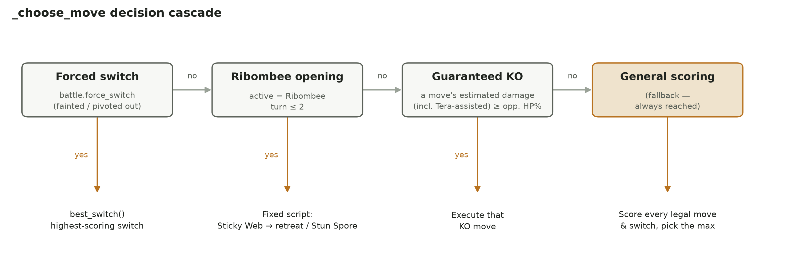
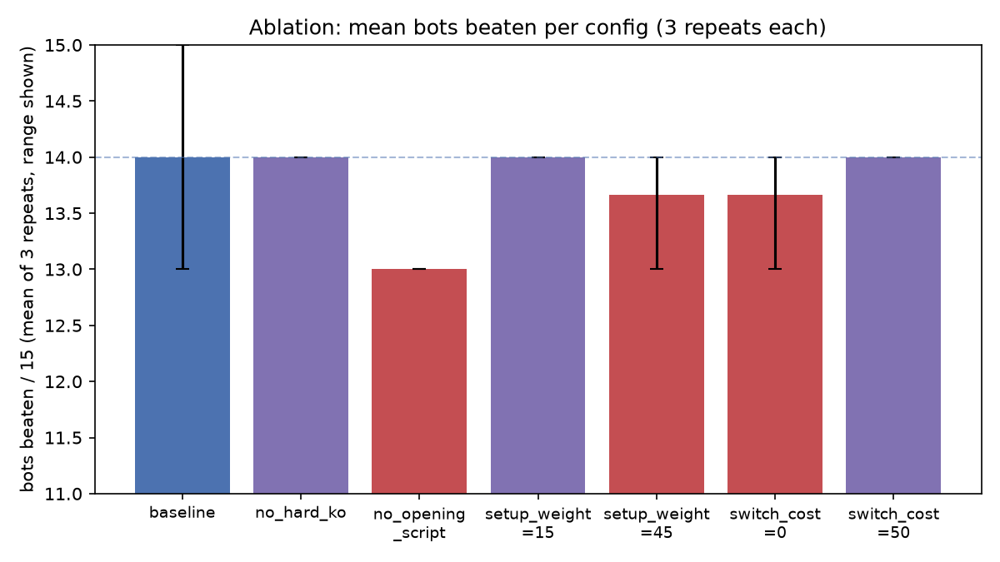

# COMPSYS 726 Report 草稿

> 写作草稿，目前是中文版本，方便先把内容和逻辑理顺，最终提交需要英文（单栏、11 号字、
> 不超过 6 页，不含参考文献）——写完中文定稿后再翻译成英文，不用现在就纠结英文措辞。
> 结构对应 [Report_Outline.md](Report_Outline.md) 里的大纲。这是草稿空间，不是最终排版稿。

---

## ⚠️ 醒目提醒：report 的方向锚点（2026-07-24，跟老师沟通确认过）

老师明确说了：这次作业主要看的是 **how you justify your design——你为什么这么设计**，不是"这个方法
怎么运作"的说明书。全篇写作都要往这个方向靠，具体锚点如下：

**专家系统三大件，report 里的每个设计决策都要能对号入座**：

| 组件 | 对应我们代码里什么 |
|---|---|
| 知识库（Knowledge Base） | 属性克制表、`STAB_MULTIPLIER`、`_max_speed_estimate` 这类编码进代码的 Pokemon 机制知识 |
| 推理机（Inference Engine） | `_choose_move` 四层级联 + `_score_move`/`_switch_score` 打分逻辑 |
| 解释设施（Explanation Facility） | `self.decision_log`——每一步决策都能倒推出"为什么选这个"，这是这次作业"专家系统"身份最直接的代码证据 |

这套三分架构不是我们自创的类比，是 MYCIN 等最早期专家系统的原始定义 [8]——这次作业的设计目标，
本质上就是在一个全新领域（Pokemon 对战）里重新走一遍这套已经有几十年历史的架构范式。

**开局脚本（`_ribombee_opening`）不是例外，反而是最正统的专家系统写法**——"if 情况 A then 动作 B"
这种产生式规则（production rule）正是 MYCIN 这类最早期专家系统的标准形式，比我们的数值化打分框架
更贴近教科书定义。判断"开局这两回合信息太少、通用打分框架反而容易做错、不如直接写死经验规则"，
这个判断本身就是专家判断力的体现，不需要额外辩护。

**必须讲清楚：消融实验/ablation 不等于机器学习，report 里要主动澄清这一点，不要让人误读**：
- ML 是"规则/参数从数据里被算法自动拟合出来"；我们做的是"规则/架构 100% 人手设计好之后，
  用数据校准架构里的几个标量常数"——`SETUP_BOOST_WEIGHT` 该是 30 还是 55，是我们自己看着
  消融表格人工判断的，不是跑一个优化算法自动收敛出来的。
- 判断标准可以直接用：①调的是 5-10 个有独立语义的标量常数，不是几千几万个没有独立含义的参数；
  ②数据的作用是**验证**已经先想清楚的规则，不是**发现**规则该长什么样；③调完之后每个数字依然
  能一句话解释清楚是什么意思，这在神经网络的权重上做不到。
- 类比："桥梁工程师测试不同梁厚度选最优值，不会因为用了实测数据就变成在做机器学习"——任何工程
  学科用数据校准一个人设计好的系统，都不叫机器学习，机器学习特指"用学习算法自动拟合"这个过程本身。

**这次经历本身对"专家系统"这个概念的新理解**（Reflections 素材）：专家系统的失败模式和 ML 系统的
失败模式是不同类的问题——这次 session 里几乎每一个 bug（换人打分方向反了、Judgment 类型没跟着
阵型解析、`_survivability_factor` 门槛太严）本质上都是**知识编码错了**（人对领域的理解转译成代码
时出偏差），不是"模型没训练好"。知识库的正确性直接决定系统上限，而知识库是人写的、人会犯错——
这是专家系统固有的脆弱点，跟"数据不够/过拟合"这类 ML 系统的脆弱点完全不同性质。

---

## 1. Introduction

Frankly,我在开始这个项目之前，没有实际玩过或看过 Pokémon 竞技对战，了解程度近乎为0。不过这种卡牌对战游戏，因为我曾经玩过炉石传说那种策略型卡牌游戏，所以我相信那种"我对对手的选项了解多少"和"在这种不确定性下该怎么分配资源"之间，跟 Pokémon 对战每一回合要做的事情类似。之所以一开始就说明这一点，不是自谦或免责声明，而是因为**这直接决定了我们的方法论**：因为没有现成的领域直觉可以依赖，整个设计过程必须从系统性的、有据可查的调研开始，而不是凭经验瞎猜。同时，这也真正贴合并采用专家系统架构 ([1][8] https://en.wikipedia.org/wiki/Expert_system), 即推理机能够利用知识库中的启发式规则进行逻辑推演，且具备明确的解释设施。这种架构设计确保了智能体在每一回合中的决策路径均是可追溯且可验证的。因为是新手，所以我们先从宝可梦对战的基础尝试发起一轮Investigation，梳理出一套战斗决策系统需要考虑的关键因素。一共识别出七个核心 factors：
1. **属性克制关系（type effectiveness）**——宝可梦各属性之间两两的伤害倍率关系，几乎是所有选招式、判断换人是否安全的决策的底层依据。
2. **技能的附加效果（move secondary effects）**——招式不只是威力数字，还带有异常状态触发几率、能力变化、场地效果（钉子/天气）、反作用力、命中率这些信息，这些共同决定了一个招式"实际是用来干什么的"。
3. **持有道具（held items）**——比如 Choice 系列锁招道具（用灵活性换威力）、不可被移除的永久变身道具、一次性防御类道具，这些道具各自带来一套额外的规则，战斗决策系统必须考虑进去。
4. **太晶化（Terastallization）**——Gen9 特有、一局限用一次、不可逆的属性切换机制，是这一代游戏里战斗中期博弈复杂度最大的来源。
5. **分级强度体系（Ubers/OU/UU/RU/NU）**——决定了对手队伍里允许出场的宝可梦强度上限，也是这次任务"五档对手强度梯队"这个结构的来源。
6. **随机的 teampreview 出场顺序**——通过查看 `poke_env` 库的源码我验证得出三种对手 AI风格选择开场首发精灵时都是**均匀随机**的，而不是固定或可预测的顺序。这个发现直接排除了任何"预判对面固定用谁开场"的设计思路，把整个方法论方向推向了"运行时通用判断的规则"，而不是"针对具体对手写死的脚本"。
7. **速度/出手顺序（turn order）**——谁先手直接决定一回合里谁的招式先生效，进而决定铺垫类招式这回合会不会先落空就被打死、要不要主动撤退这类判断的答案会完全不同。对手真实数值未知时（没有种族值以外的信息），只能用满配速度上限做保守估计，这个不确定性本身也是决策逻辑要处理的一部分。

这七个 factors,就是我们设计的策略的底层支柱。

## 2. Design

### 2.1 项目机制分析：从任务规则本身读出的设计约束

**5 档队伍强度只约束对手，不约束我方**——`bots/teams/` 目录下 uber/ou/uu/ru/nu 五档是**对手**的
队伍强度分级，我方的队伍格式只受 `battle_format="gen9ubers"` 这一个限制（Ubers 是限制最宽松的
单打分级，允许包括 Uber 分级在内的几乎所有精灵）。既然我方用同一支队伍要打全部 5 档对手，且
分级本身不限制我方能选什么，那么理性的选择很直接：**从允许范围内最强的一档（Uber）选精灵组队**，
不需要为了"公平"刻意降级——这也是队伍里 Kyogre/Koraidon/Zacian-Crowned/Eternatus/Arceus-Ghost
这几只清一色 Uber 级精灵的直接原因，是从任务规则结构（不是从"这些精灵强"这个游戏经验）推出来的
结论。

**poke_env 暴露了哪些"环境自身状态"，直接决定了方法论的下限**——比如 `teampreview_opponent_team`
能在团队预览阶段就拿到对方全部 6 只精灵（早于对方真正亮相），`battle.can_tera`/`battle.used_tera`
能读到太晶资源是否可用；完整清单见 [Poke_Env_API_Reference.md](Poke_Env_API_Reference.md)。
这类"框架到底给了我们多少信息"的核实工作，跟 Introduction 里 teampreview 随机性那条发现是同一类
方法论——设计边界不能靠猜，要靠读框架源码/文档确认。

### 2.2 对手分析：从 Teambuilder 逐队解析到"威胁 → 应对"

在 [Showdown Teambuilder](https://play.pokemonshowdown.com/teambuilder) 里把 `bots/teams/`
目录下全部 15 个 bot、30 只精灵逐一填进去，查清楚每一只的属性、特性、持有道具、完整招式效果
（不只是威力数字），整理成 [Opponent_Roster.md](Opponent_Roster.md)。只有跨多个强度档位重复
出现的规律才被当成通用设计依据写进规则里，单个 bot 的个例不纳入——这也是为什么最终没有针对任何
具体对手写死应对方案，跟 Introduction 里 teampreview 均匀随机这条发现互相印证。

| 威胁类型 | 具体表现 | 我们的应对 |
|---|---|---|
| 麻痹类招式（Cobalion/Rotom-Wash/Slowbro 等跨 3 档） | 速度直接减半，25% 概率无法行动 | `_effective_speed` 让麻痹目标速度 ×0.5，重新计算"谁先手"，避免铺垫招式在麻痹后被误判为安全 |
| 先制招式（Sucker Punch/Extreme Speed/Bullet Punch，跨多档） | 招式优先度压过速度 | `_we_move_first` 只要对面本局亮过先制招式就直接判定对面先手，无视双方数值速度，避免"我方更快、可以安全铺垫"的误判 |
| Choice 系列锁招道具（Darkrai/Metagross/Zapdos-Galar 等跨 3 档） | 第一次出招后基本锁定招式类型 | **无运行时应对**——代码不读对手持有道具，也没有"预测对面被锁定招式"的逻辑；我方 Kyogre 同样是 Choice Band 纯属队伍构筑巧合，不是利用这条信息的机制，是一个能做但没做的方向 |
| 撒钉子（Stealth Rock/Spikes，几乎每档都有） | 每次换人扣血 | **无应对**——队伍没有携带 Heavy-Duty Boots 或任何清钉招式，是队伍构成上没有解决的短板 |
| 拍落 Knock Off（几乎每档都有） | 命中后永久移除目标持有物 | Zacian-Crowned/Arceus-Ghost 的专属道具（Rusted Sword/Spooky Plate）在规则上本就不可被拍落；Eternatus 的 Power Herb 是一次性消耗道具，效果在能被拍掉之前就已经触发生效——三只合计让 Knock Off 打不到实际杀伤力 |

### 2.3 队伍构成：Hyper Offense 打法定位

队伍是用 [pokeaimmd.com/ubers](https://www.pokeaimmd.com/ubers) 这个建队工具搭的，思路定在
**速攻队（Hyper Offense）**：这是跟"需要通用规则、不针对具体对手写死"这个场景契合度最高的打法
方向——速攻队本身速度快（呼应 Introduction factor 7），全员高伤害技能，价值几乎全部体现在
"这一下打不打得穿"，不依赖"这个铺垫在三五回合后能不能兑现"这类需要跨回合价值折算的判断，
这正好匹配 2.4 节"单回合打分、不做多回合规划"这套架构能覆盖的范围，也让高额、稳定的招式威力
更容易被换算成打分公式里的权重（`_power_score` 等）——伤害越直接、越少依赖长期布局，打分的
数值就越贴近"这一步实际值多少"，控场队那类"资源要攒好几回合才兑现"的价值反而不好量化。

**队伍构成**（按上场顺序）：

| 精灵 | 定位 |
|---|---|
| Ribombee（Focus Sash，Sticky Web/Stun Spore/Moonblast/U-turn） | 开局支援：铺钉子 + 减速对面 + 免死一次的保命道具 |
| Kyogre（Choice Band + 唤雨特性，Waterfall/Body Slam/Earthquake/Tera Blast） | 雨天加成的高压物理破坏手，锁招换伤害 |
| Koraidon（Loaded Dice，Swords Dance/Scale Shot/Flare Blitz/Taunt） | 高速强化型速攻核心 |
| Zacian-Crowned（Rusted Sword + 上场自动 +1 攻击，Swords Dance/Close Combat/Behemoth Blade/Wild Charge） | 高速强化型速攻核心 |
| Eternatus（Power Herb，Sludge Bomb/Meteor Beam/Dynamax Cannon/Fire Blast） | 特殊输出，一次性蓄力大招收割残局 |
| Arceus-Ghost（Spooky Plate + Multitype，Judgment/Aura Sphere/Power Gem/Calm Mind） | 相对更耐打的特殊收尾手，兼作奶盾 |

全队只有 Ribombee 同时具备"减速对面"（Sticky Web）、"打乱对面节奏"（Stun Spore）、"零风险试探"
（Focus Sash 保证第一回合不会被秒）这三件工具，天然适合当先手支援——2.4 节的开局脚本就是把
"Ribombee 该做什么"这个从队伍分析里得出的结论直接编码成规则。

### 2.4 核心算法：if-else（开局）+ greedy（通用打分）

*（图：`_choose_move` 的四层决策级联——强制换人 → Ribombee 固定开局脚本（回合 ≤ 2）→ 硬短路
斩杀检测 → 通用单回合打分兜底，前三层任意一层条件满足就直接执行、不再往下走。生成脚本：
`analysis/plot_decision_flow.py`。）*

整个决策系统由两种写法组成，分工不同：**回合 ≤ 2 的开局用纯 if-else（写死的固定脚本），其余
所有回合用 greedy（对当前所有合法动作打分、直接选分数最高的那个，不做多回合的价值折算）**。
最终经消融验证过的核心参数：

| 参数 | 最终值 | 含义 | 消融结论（Evaluation 3.3） |
|---|---|---|---|
| 硬短路 KO 规则 | 开启 | 能斩杀就直接出招，不进打分系统 | 关闭后 15.00→14.67，唯二有真实分差的模块之一 |
| Ribombee 开局脚本 | 开启 | 回合 ≤2 用固定 if-else 脚本 | 关闭后 15.00→14.33，唯二有真实分差的模块之一 |
| `SETUP_BOOST_WEIGHT` | 55.0 | 铺垫招式每层能力提升的分值 | 从 30 校准到位；测试范围内基本不敏感 |
| `SWITCH_DEFENSE_WEIGHT` | 60.0 | 换人评分里防御端的权重 | 30/90 两个方向都测过，仍是满分 |
| `SWITCH_COST` | 25 | 换人本身的固定成本 | 0/50 都测过，仍是满分 |
| `FASTER_SURVIVAL_THRESHOLD` / `SLOWER_SURVIVAL_THRESHOLD` | 0.9 / 0.6 | 我方/对面先手时铺垫招式的容忍阈值 | 从 0.5/0.35 校准后铺垫机制才第一次真正触发（issue #7） |

**为什么开局用 if-else**：回合 1-2 双方都还没暴露任何真实数据（道具、努力值、太晶属性全部
未知），这时候通用打分框架反而容易因为信息不足做出错误判断。黏黏网起手（削弱对面后续换人的
速度）加上第二回合的麻痹粉/急速折返分支，是已经验证过在信息未知时足够稳的固定组合（这个具体
combo 本身管用，是消融证实的——关闭后 15.00→14.33），所以直接写成脚本、优先级设在通用打分
之上，不用每局重新计算"这一步该怎么打分"。

**为什么其余回合用 greedy**：中后期的局面组合太多，写死规则会在没预料到的局面下产生说不清道理
的行为——换人判断就是典型例子，"打得动但会被反打得很疼"和"打不动但很安全"这两种局面谁该排在
谁前面，本质是随双方血量、属性倍率连续变化的数值权衡，不存在能用离散 if-else 分支表达、又不会
在某个具体局面下产生反例的规则，所以换人评分把进攻/防御两个方向的分数直接相减（`候选人最强招式
的伤害估算 − 候选人挨对面攻击的倍率 × 防御风险权重`），而不是写成"能打得动就重击，否则看安不
安全"这类分支判断。这套框架也不做多回合搜索/minimax——minimax 的价值建立在"对手会针对我方
动作调整策略"这个假设上，对应 Russell & Norvig 对任务环境"single-agent vs. multi-agent"这条
分类维度里的对抗性环境 [9]；但查过 `poke_env` 源码，评测用的三种 AI 风格都不会针对我方动作
调整策略，往后推演多个回合换不来额外收益，单回合打分（greedy）在这个前提下就够用，也更符合
专家系统"每一步决策可解释"的定位。而且通过 `poke_env` 源码验证过，对手每局的出场首发本身是
均匀随机的（Introduction factor 6）、道具/努力值/太晶属性都要等亮相才知道——这种"信息不完整、
局面组合数人手枚举不完"的情况正是 greedy 打分框架要处理的场景，跟开局那两回合"信息虽然也不
完整、但分支数量少到能人手穷举清楚"正好相反，也是为什么两种写法要分开用，不是选一种就够。这个
"对手不博弈"的前提只对固定 bot 梯队成立——以后如果打班级竞赛，对手换成同学自己写的、可能会
反制我方套路的智能体，且规则上我们也只能看到对面这局已经亮出过的招式（不是完整招式池），这条
前提是否依然成立没有验证过。

## 3. Evaluation

### 3.1 Evaluation Methodology：单次评分 vs. 我们自己的调参可信度

作业本身对"赢没赢一个 bot"的判定规则很直接：每个 bot 打 3 局（best-of-three），胜率 >0.5（也就是
3 局赢 ≥2 局）就算赢下这个 bot；最终名次按打赢的 bot 数量排，映射到分数表（`expert_main.py` 的
`assign_marks`）。关键的一点是：**这个评测大概率只会被官方跑一次**——教学团队拿到提交的智能体后，
用固定的 15-bot 梯队评一遍，那一次运行的结果（不管过程中招式命中/伤害浮动/AI 自身随机性带来多少
变数）就是最终成绩，不会反复跑几轮取平均。

这里有一个方法论上的区分，我们在开发过程中主动做出来了，值得写清楚。我们发现：**同一份智能体代码，
对着同一个固定梯队重跑，结果会不一样**（比如两次完全相同的代码，一次打赢 13/15，一次打赢 14/15）；
甚至两个只差一个可调参数的配置，总分打平，但输给的却是不同的 bot。这说明单次评测结果不足以用来
可靠地比较两个候选设计或参数取值——单次"赢了"的那个配置，很可能只是运气好，这跟系统评测方法论
里"看似一致、可复现的数据，也可能是测量本身的偏差而不是被测系统的真实属性"这条经典教训 [10]
是同一个道理（4.5 节会讲一个我们自己真实撞上这条教训的案例）。为了让我们自己的
迭代调参决策站得住脚，我们把本地的消融实验工具（`analysis/run_ablation.py`）扩展成支持对每组候选
配置重复跑完整的 15-bot 梯队若干次，报告"打赢 bot 数"的均值和标准差，而不是只信一次的结果。
只有当两个配置之间的差异明显大于多次重跑观察到的噪声范围（标准差）时，才把这个差异当成真实存在、
值得保留的效果。

这里必须诚实说明一点：**这套"多次重跑"的方法论只用在我们自己内部的调参决策上，不会改变作业本身
的评分方式**。真正被打分的那一次提交，依然只跑一遍固定梯队，所以不管调参过程做得多严谨，最终成绩
里始终会带有那一次运行本身的运气成分。多次重跑调参买到的不是"评分那天一定表现好"这个保证，而是
**提高"我们提交的这套参数平均表现确实更强"的把握，从而提高评分那天抽到好结果的概率**。这个"可靠地
评估一个设计选择"和"任何单次评测本身固有的方差"之间的区别，本身就值得在报告里讲清楚——它也直接
促成了一部分设计目标：与其只是"绕着方差调参数"，不如直接想办法**降低方差本身**（比如硬短路
KO 规则本身就能缩短回合数、减少对局被随机性拖偏的机会，见 2.4），后者对"评分那天也稳定表现好"
更有直接帮助。

### 3.2 实验一：队伍强度 vs. 决策逻辑的贡献隔离（控制变量）

评分标准明确要求"不能只看排名好不好，要证明方法本身是按设计在起作用"。为此我们在早期做了一次
控制变量实验：先把队伍换成一支网上找的高强度 Ubers 队伍（后续一直沿用，没再换过），但 `_choose_move`
先不动、继续用框架自带的纯随机选招（`choose_random_move`）。这样"队伍强度"和"决策逻辑"这两个
变量就被分开了——只看光靠数值压制、招式随便选，纯随机能拿下几场。

结果：`#15 名，mark=1.0，1/15 bots beaten`——15 个 bot 里只赢了 `random-ru` 这一个（胜率
0.67，其余全部 <0.5）。也就是说，**同一支强度队伍，光靠随机选招基本等于送人头**；后面把决策逻辑
换成我们的规则系统后（队伍完全没变），胜场从 1/15 跳到 14+/15（见下一节消融表格里的 `baseline`
行）。这个跳变直接证明了：胜率的提升主要来自我们设计的决策逻辑，而不是"队伍本来就选得好、随便
打打也能赢"——这正是评分标准要求的"证明方法本身按设计运作"的量化证据。

### 3.3 实验二/三：消融实验——从单次筛选到多次重跑确认，量化每条规则/权重的贡献

上一节隔离的是"要不要有决策逻辑"这个粗粒度问题；这一节往下细化一层——**决策逻辑内部具体哪几条
规则、哪个权重，真的在按设计起作用**，同样是靠数据说话、不是凭直觉调参数。这也是 3.1 节讲的
方法论区分在实践中的具体应用：先用一次筛选低成本找方向，再用多次重跑把噪声和真实效果分开。

方法论上分两轮做：第一轮（2026-07-21）是单次筛选，目的只是低成本找出哪些参数值得深挖，不直接
下结论；第二轮起是多次重跑确认（每组配置重跑 3 次，取均值和标准差），只有差异明显大于重跑噪声
才当成真实效果。决策逻辑本身经过 v1→v2→v3 三个阶段的迭代，每个阶段收尾时都固定跑一轮"最终结果"
消融，三轮数据放在一起，本身就是"设计改动是否真的按预期提升了表现"最直接的量化证据。完整数据见
`analysis/results/`，逐条解读见 [Ablation_Study.md](Ablation_Study.md)。

**v1 最终结果**（六处决策逻辑正确性修复后，2026-07-23）：

| 配置 | mean 胜场 / 15 | stdev |
|---|---|---|
| **`baseline`** | **14.33** | 0.29 |
| `no_hard_ko` | 14.00 | 0.00 |
| `no_opening_script` | 13.00 | 0.00 |
| `setup_weight_15` | 13.67 | 0.29 |
| `setup_weight_45` | 14.00 | 0.00 |
| `switch_cost_0` | 14.00 | 0.00 |
| `switch_cost_50` | 14.00 | 0.00 |

`baseline` 首次成为单独最优配置——六处正确性修复（Judgment 类型解析、Scale Shot 多段伤害、
换人打分方向等）本身就是这一轮最大的提升来源，参数微调的边际收益比预期小。

**v2 最终结果**（新增 Taunt 反叠盾 / 团队预览克制对照表 / 钉子延迟收益打分后，2026-07-23）：

| 配置 | mean 胜场 / 15 | stdev |
|---|---|---|
| **`baseline`** | **14.33** | 0.29 |
| `no_hard_ko` | 14.00 | 0.00 |
| `no_opening_script` | 13.00 | 0.00 |
| `setup_weight_15` | 14.00 | 0.00 |
| `setup_weight_45` | 14.00 | 0.00 |
| `switch_cost_0` | 13.67 | 0.29 |
| `switch_cost_50` | 14.00 | 0.00 |

`baseline` 分数没变（三个新功能都是通用机制，只在默认框架原本判断不够好的边缘情况才介入，默认
配置本来就没怎么依赖这些边缘情况）；`setup_weight_15`/`switch_cost_0` 相对 v1 互换了位置，跟
v1 轮对照能看出这两个参数的"最优方向"在反复消融中并不稳定，不是一次测完就能定死的常量。

**v3 最终结果**（新增太晶断死 + 消融工具进程隔离修复后，2026-07-24，当前有效数据）：

| 配置 | 改动 | mean 胜场 / 15 | stdev |
|---|---|---|---|
| **`baseline`** | 不改，默认值 | **15.00** | 0.00 |
| `no_hard_ko` | 关闭硬短路 KO 规则 | 14.67 | 0.29 |
| `no_opening_script` | 关闭 Ribombee 固定开局脚本 | 14.33 | 0.29 |
| `setup_weight_15` | 铺垫打分权重 30→15 | 15.00 | 0.00 |
| `setup_weight_45` | 铺垫打分权重 30→45 | 14.67 | 0.29 |
| `switch_defense_weight_30` | 换人防御权重 60→30 | 15.00 | 0.00 |
| `switch_defense_weight_90` | 换人防御权重 60→90 | 15.00 | 0.00 |
| `switch_cost_0` | 换人成本 25→0 | 15.00 | 0.00 |
| `switch_cost_50` | 换人成本 25→50 | 15.00 | 0.00 |

三个观察：

1. **`baseline` 从 v1/v2 的 14.33 涨到满分 15.00**（3 次重跑标准差 0）——这不是决策逻辑本身在
   v3 变强了（太晶断死这个功能几乎不影响总分，见 4.5 节前半段），而是消融测试工具本身的一个
   bug 被修复了（同一进程多次 repeat 累积残留连接，虚增了 `max_damage-uber` 的超时率）——三轮
   数据放在一起对比，这个"提升"从哪来才看得清楚，单看 v3 这一轮表格会误以为是决策逻辑改进的
   功劳，细节见 4.5 节。
2. **只有两个模块的存在与否能造成可复现的、真实的分差**：`no_hard_ko`（关掉硬短路 KO）和
   `no_opening_script`（关掉 Ribombee 固定开局脚本）分别掉到 14.67 和 14.33/15，查过逐对手明细
   （`per_bot_summary.csv`），损失的对手是真实游戏内输赢（不是超时），集中在 `simple-uber`
   （poke_env 自带的 `SimpleHeuristicsPlayer`，会真的铺钉子/强化/换人，比 `max_damage` 那种纯
   贪心 AI 更有策略性）——这是硬短路 KO 和开局脚本这两个模块目前唯一能测出来的、可解释的贡献。
3. **权重类参数在测过的取值范围内基本不敏感**：`SETUP_BOOST_WEIGHT`/`SWITCH_DEFENSE_WEIGHT`/
   `SWITCH_COST` 改动后大多数取值仍然是满分，只有 `SETUP_BOOST_WEIGHT=45` 掉了一点点；结合默认值
   本身已经是满分之一，暂不改动。v1/v2 两轮数据里这几个参数"最优方向反复反转"的不稳定现象，在
   干净数据下基本消失——之前的"反转"很大一部分本身就是被超时噪声制造出来的假象。

## 4. Reflections

### 4.1 这次作业到底难在哪：从任务本身，到每个版本具体踩的坑

这个作业本身"实现"起来不难——`_choose_move` 说到底就是两个 Python 文件里的一些函数，真正的
难点不在写代码，在**每一次踩坑之后，怎么判断"这是知识编码错了"还是"这是环境本身的不确定性"**。
这跟报告开头醒目提醒块讲的那条区分是同一件事：专家系统的知识库是人写的，人会犯错，这跟 ML 系统
"数据不够/过拟合"是完全不同性质的脆弱点——本节想具体讲清楚这种脆弱点在这次项目里实际长什么样。

**任务本身固有的难点（不是实现难度，是这类问题本身的难度）**：

1. **对手信息永远不完整**——teampreview 阶段之外，对手精灵的具体数值、努力值、太晶属性都要等
   亮相才知道，逼着知识库里必须写"保守假设"类规则（`_max_speed_estimate` 统一按满配速度上限
   估算），而不是精确计算。这正是专家系统在不完全信息环境下的典型形态：知识库里必须显式编码
   "不知道的时候怎么办"这条元规则，不能假装信息总是完整的。
2. **评测环境本身非确定**——战斗机制随机性（命中率/暴击/异常状态几率）叠加对手随机首发，导致
   "这个改动到底有没有用"本身就很难回答，逼着我们建了一整套"多次重跑确认"的方法论（Evaluation
   3.1 节），单次结果不能直接当结论用。
3. **知识库的正确性完全压在人身上**——没有训练数据能帮忙纠错，任何一次对游戏机制的理解偏差
   会直接编码进规则，且很难自己发现（好几个 bug 是系统性审查才挖出来的，不是靠运行时报错发现
   的，因为规则本身语法上完全合法，只是语义错了）。这是专家系统范式特有的脆弱点：ML 系统错在
   "学歪了"，专家系统错在"人想歪了还写死了"。

**每个版本具体踩的坑**：

- **v1**：`_switch_score` 换人打分方向反了——不是笔误，是最初设计换人评分公式时，"进攻端"和
  "防御端"两个方向的语义本身理解错了，靠对局输赢异常倒推查出来的。属于"知识转译成代码"这一步
  出错的典型案例：规则的结构是对的（两个方向相减），但两个方向各自该加还是该减写反了。
- **v2**：`max_damage-uber` 拖到超时最初被诊断成"对面冥想回血叠盾拖时间"，围绕这个假设做了
  两版功能（Taunt 反叠盾、克制对照表），后来查 `bots/max_damage.py` 源码才发现假设本身是错的
  ——这个 bot 永远只选最高威力招式，根本不会用变化招式。教训：**设计修复之前要先去读对手的
  实际实现，不能凭"典型打法"的经验去猜**，这也是专家系统"知识必须来自可验证的来源，不是直觉"
  这条原则的一次真实代价。
- **v3（太晶化）**：code review 抓到两个隐藏 bug——Judgment 太晶后属性判断方向写反了（查
  poke_env 自带的官方伤害计算器源码才确认真相），以及 `Pokemon.tera_type` 这个属性的真实语义
  （"协议已揭示的太晶后属性"而不是"配置好、一开始就知道的太晶属性"）跟直觉完全相反——属于
  "框架 API 名字容易让人望文生义猜错"的坑，知识库里一条看似正确的规则，源头其实是对第三方
  工具语义的误解。v1 当时没有实现太晶化，理由是"这一下能不能把局面掰回来"涉及的变量太多、
  容易出错——这两个 bug 反过来正好验证了这条 v1 时期的判断是对的，不是凭空担心。
- **消融工具本身的坑（issue #14）**：一度以为的"结构性、决策逻辑解决不了"的超时问题，最后
  查出来是我们自己的测试脚本有 bug（同一进程多次 repeat 用户名递增导致连接残留），不是被测的
  智能体本身（4.5 节详细展开）。这是一类完全不同的困难——**不是"知识库写错了"，是"验证知识库
  对不对的工具本身不可靠"**，专家系统的解释设施再完整，也没法弥补测量装置本身的偏差。
- **`_survivability_factor`/`SETUP_BOOST_WEIGHT`（issue #7）**：第一版修复方案逻辑上说得通，
  但 code review 指出它在"最常触发的场景"（满血时）下完全不生效——一条推理链条听起来合理、
  却没有真正命中根因。改对之后又发现一个连带参数（`SETUP_BOOST_WEIGHT`）之前一直"因为乘在一个
  几乎恒为 0 的门槛上而没有意义"——一个 bug 会掩盖另一个参数的真实效果，修复的依赖关系比想象
  的复杂。
- **招式先制修复（issue #15/#16）**：逻辑严格验证是对的（单测、code review 都过了），但消融
  测出一个真实、可复现、却查不清楚具体因果的小代价——`baseline` 对 `simple-uber` 从稳定 3/3
  掉到 2/3，A/B 对照确认了方向和幅度，但翻查具体输局日志时，真正秒掉我方的是一次 0 优先度的
  纯速度压制，改动本身涉及的先制招式全程没被用过，说明不是直接因果，更像是通过战斗随机性间接
  影响了整局走向。专门查过"能不能固定随机种子重放来做严格对照实验"——查了 `pokemon-showdown`
  和 `poke_env` 源码后确认：底层引擎虽然支持指定种子，但我们实际使用的标准对战协议从来不会把
  种子暴露给客户端；更深一层，就算暴露了，"决策一旦分叉，后续随机数消耗顺序本该不同"这件事本身
  也不是能被"控制变量"掉的巧合，而是决策后果的一部分，真正干净的对照需要战斗中途存档分支重跑，
  是一个跟这一行代码的验证任务完全不成比例的独立工程项目。教训：**不是所有因果都能被完全查
  清楚，有时候只能确认"相关性稳定存在"就要做取舍决策，而且这次连"这个局限本身有多深"都专门
  查证过、不是停留在"感觉查不清楚"这个直觉层面——这是非确定性环境本身的认识论极限，不是调查
  不够努力**。

**串起来看**：难点的性质在演变——v1 是"知识转译成代码时出错"，v2 是"假设没验证就动手设计"，
v3 之后开始出现"第三方框架语义比想象的复杂"和"测量工具本身不可靠"这两类元问题，最新阶段是
"某些因果关系在非确定性环境下，就算专门投入精力去查证'能不能查清楚'这件事本身，也可能得到
'查不清楚'这个确定的答案"。这个演变过程本身，就是"对专家智能体这个概念的新理解"最好的素材：
一开始以为专家系统的难点只在"知识写没写对"，到后来才意识到"知识运行在什么样的环境里、怎么验证
知识写对了"同样是专家系统设计里不能回避的一部分。

### 4.4 评测本身的随机性：三层原因，不能简单归因为"样本小"或"90 秒超时"

前面 Evaluation 反复用到"噪声"/"标准差"这些词，这里专门拆开讲清楚噪声到底从哪来——因为
"数据集太小"和"90 秒超时"看起来像是两个原因，但仔细想其实它们的角色不一样，一个是根本原因，
一个只是让根本原因暴露/放大出来的机制。我们把它拆成三层：

**第一层，真正的随机性根源——战斗机制本身**。这是不管样本量多大都不会消失的东西：招式命中率
判定（不是所有招式 100% 命中）、暴击判定、异常状态附加几率（麻痹全麻、混乱自伤、畏缩）、以及
最关键的一条——**三种对手 AI 风格选首发精灵都是均匀随机的**（这个在 Introduction 里已经提过，
是查 `poke_env` 源码级验证过的，不是猜的）。每一局对面开场派谁上来都不一样，直接改变那一局的
属性克制/速度关系/开局节奏，是目前观察到的胜率波动里权重最大的一个来源。就算把样本量拉到无限大，
这层随机性本身也不会消失——它只会被"平均掉"，而不是被"消除"。

**第二层，样本量太小——不是随机性的来源，而是"没能力把第一层平均掉"**。官方判定规则是 Bo3
（3 局取胜率），我们自己筛选轮也只跑 1 次完整 15-bot 梯队。样本越小，单次幸运/不幸的一局对
"这个 bot 算赢还是算输"这个二元判定的权重就越大——这也是 Evaluation 3.1 节讲的"为什么要做多次
重跑"的直接动机：重跑本身不会让第一层的随机性变小，只是让我们能看清楚它的分布，不被单次结果
骗过去。

**第三层，90 秒超时——一个阈值效应，理论上会把连续的随机性折叠成二元胜负标签，只在少数"天生
拖得久"的对局上才会被放大到能看见的程度**。`MATCH_TIMEOUT_SECONDS=90` 是评测框架的硬约束（不是
我们能改的参数），大多数对局在 15-30 回合内结束，离这道墙还很远，第三层基本不起作用。理论上，
如果存在一个"天生拖得久"的对局（比如对面带高耐久、难以打穿的配置），第一层的随机性让某一局多打
/少打几个回合，就可能直接决定这一局是在超时前正常分出胜负，还是被判负——4.5 节会讲一个我们自己
真实遇到的案例：一度以为找到了这样的对局，最后发现那次观测本身是错的。

**串起来看**：根本随机性（对手随机首发 + 招式概率判定，第一层）→ 理论上会在少数拖得久的对局里被
90 秒超时放大成非黑即白的胜负标签（第三层）→ 样本量太小时（第二层）这个二元结果就可能直接决定
我们对"这个配置到底好不好"的判断是否可信。这本质上是**纯规则专家系统在一个非确定性环境里的固有
局限**：规则本身可以是完全确定、可解释、可追溯的，但规则运行的环境不是，所以"这套规则设计得对
不对"这件事，永远只能用概率/统计的方式去验证，不存在一次跑完就能盖棺定论的"正确性证明"——这也是
为什么"多次重跑"是我们应对第一层/第二层不确定性的核心方法论（Evaluation 3.1 节），但 4.5 节的
案例说明，光靠"多跑几次"还不够，还得反过来审视测量工具本身有没有引入它自己的偏差。

### 4.5 一次被推翻的"结构性问题"结论：when 度量工具本身有偏差，多跑几次也救不回来

前面几轮消融实验里，`max_damage-uber`（对面配置里有个高耐久精灵）反复表现为一个"稳定输/超时"
的对手：`baseline` 配置连续七八轮完全不同方向的代码改动下，它的胜率始终精确复现同一个数字
（约 1/3，标准差 0.58），跨越了 6 处正确性修复 + Taunt 反叠盾 + 克制对照表 + 延迟收益打分 +
多组阈值调整。这种"改什么都不变"的稳定性，在当时看起来是最强的证据——按 3.1 节的方法论（不信
单次结果，只信多次重跑的稳定信号），我们据此正式下了结案定论：这是当前"单回合贪心打分、不做
多回合规划"这套决策范式解决不了的结构性缺陷，源头是 4.4 节讲的三层随机性叠加，不再投入精力
专门解决。

这个结论后来被证明是错的，而且错误的位置很有意思——不是决策逻辑，是**我们自己写的消融测试
工具**。我们的消融脚本为了在同一个 Python 进程里连续跑多次重跑，给每次重跑里的 15 个 bot 账号
都用递增的用户名（避免用户名冲突报错）。但代价是：Pokemon Showdown 协议本身的行为是"同名重新
登录会顶替旧会话"，而递增用户名绕开冲突的同时，也让旧连接永远不会被顶替/清理，在同一个进程的
生命周期内不断累积、拖慢本地对战服务器——这跟真正评测时"每次都是全新进程、用户名固定"的干净
状态完全不同。也就是说：我们观测到的"稳定复现的超时"，稳定复现的其实是**测试工具自己的副作用**，
不是被测系统（决策逻辑）的属性。把工具改成每次重跑都用独立进程（复现真实评测的干净行为）后，
同样的配置连续 27 次独立重跑，这个对手一次都没有再超时过。

这件事对我们方法论上的教训，比"这个 bug 修好了"本身更重要：**"多次重跑、结果依然稳定"只能证明
这个观测结果不是随机噪声，不能证明这个观测结果反映的是被测系统本身、而不是测量装置本身**——
一个有偏差但确定性的测量工具，会产生跟"真实、稳定的现象"完全无法区分的数据，这正是系统评测
方法论里一条经过专门论证的经典教训 [10]，不是我们这次运气不好才踩到的孤例。3.1 节讲的"不信
单次结果"这个纪律，防住的是随机噪声这一类错误；这次踩的坑是另一类，需要额外的纪律：**在把
"稳定复现"当作证据之前，先确认测量链路本身（这里是"评测脚本的进程/连接生命周期"）跟被测量的
真实场景（这里是"官方评测怎么调用 `expert_main.py`"）是不是同一回事**。这也是为什么这个结论
被推翻的契机不是又跑了一轮消融，而是回头去读评测框架本身的源码，把"90 秒超时"这个约束的字面
语义（包住整个 Bo3，还是每局各算）重新核实了一遍——细节见 Evaluation 3.1 节。

### 4.6 回头看 greedy 打分 vs if-elif/hardcode：不是对立的两派，是同一套系统里分工不同的两块

这个对比不需要假设——我们自己的系统里两种写法就是同时在跑：2.4 节 Ribombee 开局脚本是纯粹的
if-elif/hardcode，其余所有回合走的是 2.4 节的通用打分（greedy）框架。真正做完、拿真实消融数据
（3.3 节）比对之后，看到的结果跟动手之前的直觉不太一样。

直觉上会觉得"通用的连续打分框架更精细，应该贡献更大"，但 3.3 节的数字说的是另一回事：`no_hard_ko`
（关掉硬短路 KO）和 `no_opening_script`（关掉开局脚本）——两个纯 hardcode/短路规则——分别让
`baseline` 从 15.00 掉到 14.67 和 14.33，是全部消融配置里仅有的两处可复现的真实分差；反过来，
`SETUP_BOOST_WEIGHT`/`SWITCH_DEFENSE_WEIGHT`/`SWITCH_COST` 这些连续打分框架里的权重，在测过的
取值范围内改动后几乎全部还是满分 15.00。也就是说，实际测出来贡献最大的两块，恰恰是两条写死的
规则，不是打分框架本身的精细调校。

这不是"hardcode 比 greedy 更好"这个结论，而是两者本来就该在不同的区域起作用，Russell & Norvig
的确定性/随机性环境分类框架 [9]（2.4 节已经用过）在这里同样适用：if-elif/hardcode 赢在信息
确定、分支数量人手能穷举清楚的区域（开局头两回合、"这一下能不能斩杀"），一旦条件满足，判断
100% 没有歧义；greedy 打分赢在信息不确定、组合数量人手枚举不完的区域（中后期任意局面），代价
是单条规则的精度天然打折扣（这也解释了为什么权重在合理范围内改动大多不敏感——打分框架本来就是
为"覆盖面"设计的，不是为"某个权重必须精确"设计的）。但两者本质上还是同一类系统：打分公式一样是
人手写死的（`_switch_score` 换人打分方向反过的那次 bug，出在打分框架里，不是 if-elif 里），一样
会犯"知识编码错了"这种专家系统特有的错，谁的推理链条更长不影响这一点。这次经历给的实际结论是：
先看这个子问题的信息够不够确定、分支能不能被人手穷举，再决定用哪种写法，而不是预设"通用框架
总是更优越"。

## References

[1] Wikipedia. *Expert system*. https://en.wikipedia.org/wiki/Expert_system
（Introduction 引用，专家系统架构定义——推理机 + 知识库 + 解释设施）

[2] hsahovic et al. *poke_env* (GitHub repository). https://github.com/hsahovic/poke_env
（对战框架，封装 Pokemon Showdown 协议；`Pokemon`/`Move`/`Battle` 等 API 语义贯穿整个决策逻辑，
Design/Evaluation 多处引用）

[3] Smogon / Pokemon Showdown. *pokemon-showdown* (GitHub repository).
https://github.com/smogon/pokemon-showdown（本地对战服务器，`node pokemon-showdown start --no-security`）

[4] Pokemon Showdown. *Teambuilder*. https://play.pokemonshowdown.com/teambuilder
（逐队解析 15 个对手 bot 的属性/特性/道具/招式的工具，Design 2.2）

[5] Smogon. *Gen 9 Ubers format rules*. https://www.smogon.com/dex/sv/formats/uber/
（队伍构筑必须遵守的分级强度/格式规则，Introduction factor 5）

[6] pokeAImmd. *Ubers Team Builder*. https://www.pokeaimmd.com/ubers
（搭建我方队伍用的建队工具，Design 2.3）

[7] UoA-CARES. *showdown_agent* (GitHub repository, course starter code).
https://github.com/UoA-CARES/showdown_agent
（课程提供的评测框架代码：`expert_main.py`/`bots/`/`submission_sanity.py` 等，本项目只修改
`players/<upi>.py` 一个文件）

[8] Buchanan, B. G., & Shortliffe, E. H. (1984). *Rule-Based Expert Systems: The MYCIN Experiments
of the Stanford Heuristic Programming Project*. Addison-Wesley.
（专家系统"知识库 + 推理机 + 解释设施"三分架构的原始/权威来源，醒目提醒块与 Introduction 引用）

[9] Russell, S. J., & Norvig, P. *Artificial Intelligence: A Modern Approach*.
（task environment properties 分类框架——deterministic vs. stochastic、single-agent vs.
multi-agent，支撑 2.4 节"为什么不做多回合搜索/minimax"和 4.6 节 if-elif/greedy 回顾性对比
两处论证）

[10] Mytkowicz, T., Diwan, A., Hauswirth, M., & Sweeney, P. F. (2009). *Producing Wrong Data
Without Doing Anything Obviously Wrong!* ASPLOS 2009.
（系统评测方法论经典论文——测量装置本身的偏差会稳定复现出错误但看似一致的数据，支撑 Evaluation
3.1 节"单次评测不可靠、要多次重跑"与 Reflections 4.5 节"消融工具连接泄漏偏差稳定复现假信号"
两处）
